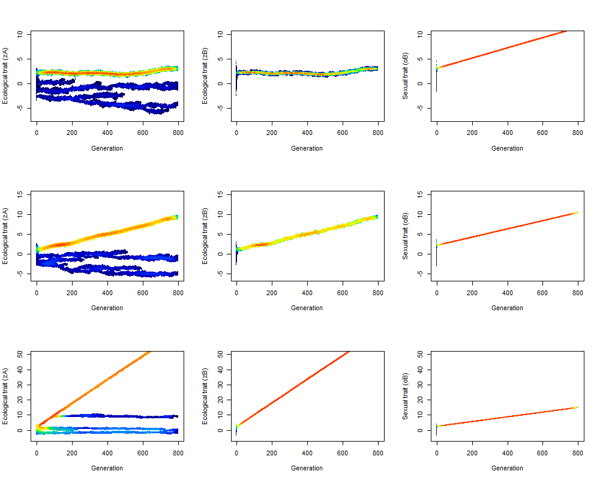

## Introduction

Theoretical models and empirical evidence assume that sympatric speciation can arise if frequency-dependent ecological interactions favor extreme phenotypes and generate disruptive natural selection [@Maynard-Smith1966; @Kirkpatrick2002; @Dieckmann2004]. Besides mating patterns that ensure reproductive isolation, mainly assortative mating [@Rosenzweig1978; @Dieckmann1999; @Bolnick2007]. However, other ecological interactions may impose conflicting selective pressures on the same trait that restrict or suppress the diversification process [@Raimundo2014].

Both general conditions for adaptive divergence can be satisfied more easily when the genetic architecture is defined by a magic trait -- a single phenotypic trait mediates both ecological interactions as well as sexual interactions [sensu @Servedio2011]. Alternatively, another genetic architecture with the potential to sustain the conditions necessary for adaptive sympatric speciation occurs with genetic correlations between quantitative phenotypic traits that can respond to distinct selective regimes [@Lande1981; @Lande1983].

Among the mating patterns with the potential to influence adaptive diversification, assortative mating has already been studied extensively in models of sympatric speciation [reviewed in @Gavrilets2004]. However, interacting species that impact the adaptive process may have distinct mating choices, like directional mating choices in which females prefer males with exaggerated ornaments. To investigate how directional mate choice influences adaptive diversification, we modified an adaptive model with a mutualistic system, considering contrasting genetic architectures underlying the traits that mediate ecological and sexual interactions.

## Material and Methods

The model structure incorporates individual-based simulations and simulates the phenotypic evolution, considering populations of two interacting species (A and B). Thus, two phenotypes characterize the species: one that mediates ecological interactions (zA and zB); and another, the females' choice (oB) for species B. In scenarios in which we considered magical traits, the values of the zA and zB phenotypes mediate ecological interactions and sexual choices. We sampled the initial distribution of the phenotypes in each population from a normal distribution with a mean of 0 and a standard deviation of 0.5. Alternatively, in scenarios where we assumed the genetic correlation between the distinct phenotypes of species B, the trait oB mediates female choice, determining male ornament phenotype, and zB controls ecological interactions. We sampled the initial distribution of these phenotypes from a multivariate normal distribution and simulated three scenarios with different genetic correlations (r=1, r=0.5, r=0.1 and r=0).

The model assumes that the competition is higher among individuals with similar phenotypes, resulting in frequency-dependent disruptive selection. P(comp) determines one of the components of fitness that represents the penalty imposed by intraspecific competition [see the equations in @Raimundo2014]. The mutualistic interactions occurred by trait matching, in which the individuals of species B actively selected partners of species A, according to the phenotypic complementarity, which implies a stabilizing selection. Each individual of species B interacts with an interspecific individual with the most complementary phenotype. The benefits arising from mutualistic interactions define a fitness component P(mut).

In reproduction, species A occurs by assortative mating choice. For species B, the female choice is for the male with the highest sexual trait. But each female of the population can access just a subset of 5% of males existing in the population, according to the fitness P(mat) -- the penalty of competition and the benefit of mutualism. This condition assumes that no female has access to all existing males. In order to explore the effects of directional mating, the probability of the female choosing a male depends on a criterion based on exaggerated phenotype -- the difference between the phenotypes of males and the maximum value of the phenotype among all males in the subset. Finally, we generated the offspring of the next generation by all females in the population. We defined the offspring phenotype as the mean of the phenotype values of the female and the male chosen by her for mating, plus or minus a segregation variance.

## Results

In our scenarios with the directional mating pattern, the pattern of adaptive irradiation of the original model is broken, B species has not show events of speciation. Under genetic architecture correlation equals 0 and 0.1, there was no inhibition of adaptive irradiation observed in A due to the influence of directional sexual selection in B, as noted in the analogous scenario with a magic trait. Besides the evolutionary dynamics of species A decoupled from the phenotypic evolution patterns of the species.

Under the magic trait genetic architecture, sexual selection proved to be the prevailing regime and led to the adaptive dynamics of the entire system, maintaining the original richness of 2 species (A and B) at the end of the simulation. However, interestingly, although the adaptive irradiation expected for A as a function of strong frequency dependence associated with assortative mating was suppressed by the prevalence of directional selection as a driver of evolutionary dynamics, at least 3 independent speciation events occurred from the species A without the new species derived from it, of low abundance, persisting at the end of the considered simulation time.

```{r sad, echo=FALSE, fig.cap = "Figure 1. Scenarios of the phenotypic evolution of species A and B with different genotypic architectures under the directional mating pattern. In the first row, there is no correlation between traits (r=0), the second row, weak correlation (r=0.1) and the last row represents a magic trait (r=1). Color temperature indicates the density of individuals, ranging from high (warm colors) to low (cool colors).", out.width=1000}

```

The effect of sexual selection imposed by a directional mate choice depends on the underlying genetic architecture. Sexual selection drives the evolutionary dynamics of the system if it has a presence of magic traits or strong correlation between traits. However, if ecological and sexual interactions are mediated by two distinct, genetically correlated traits, disruptive natural selection promotes adaptive radiation in one of the species and the evolutionary dynamics of the system become decoupled.

## Discussion

The Fisherian selection model ("runaway selection" Fisher 1930) assumes that females will choose males with traits that have a reproductive advantage. The male's ornament trait increases until the point in which there is no more advantage in reproductive success due to reduced male survival. In the present model, no such point has been imposed at which excessive ornamentation leads to decreasing in survival or reproduction, setting a ceiling for phenotypic evolution by sexual selection [@Kodric-Brown1984].

In the scenario under magic trait architecture, the evolutionary dynamics imposed by sexual selection prevailed at the assemblage level, altering the phenotypic evolution of species A, despite the strong frequency dependence and present assortativity, which coevolutionary converged with the scaling generated in B by the directional selection imposed by directional mating hinders the speciation process [@vanDoorn2009]. However, different speciation events occurred, with one of the clades following the phenotypic evolution towards exaggerated ornament and the other remaining at lower trait values, which can be attributed to the disruptive regime of A. However, the mechanism that generates the stabilization of clades derived from A that diverges from the phenotype scaling process, which no longer diversifies, remains to be explored.

Still, about A clades that diverge from the trait maximization process, recurrent extinctions probably occur as random events due to the low density of these species [@Purvis2000].Under the architecture of genetic correlation, the prevalence of sexual selection as the driving force of the phenotypic evolution of the multispecific system ceases and species A starts to exhibit adaptive irradiation dynamic. This decoupling of evolutionary dynamics shows that the result of the interaction between natural selection and sexual selection propagates at the assembly level only when the interactions are mediated by magical traits and in greater degrees of genetic correlation.

## References
